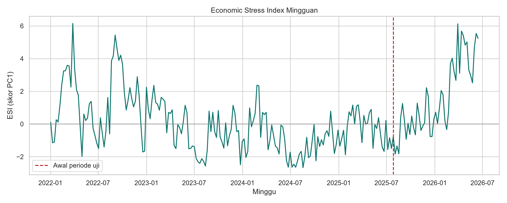
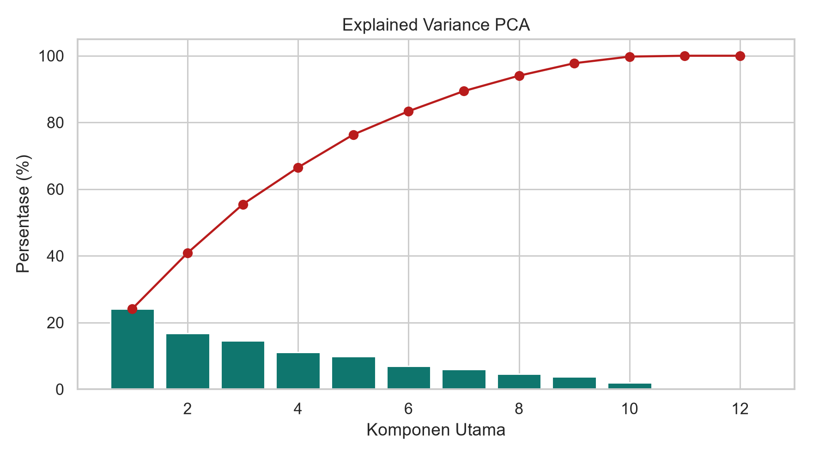
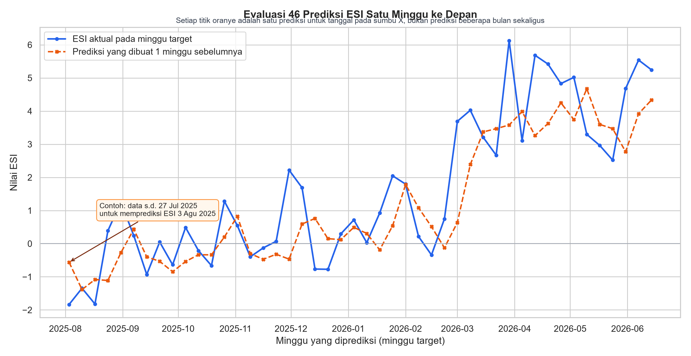
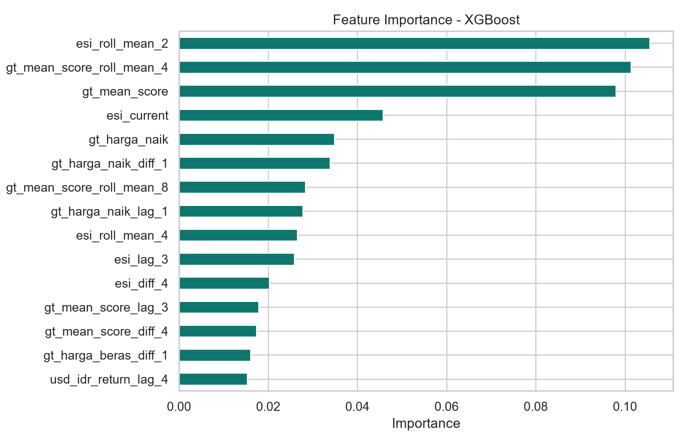
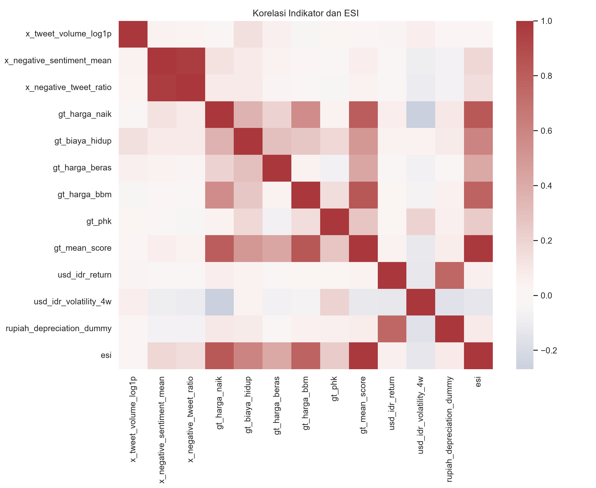

# PEMODELAN DAN PREDIKSI INDEKS TEKANAN EKONOMI MASYARAKAT INDONESIA BERBASIS MEDIA SOSIAL, TREN PENELUSURAN, DAN NILAI TUKAR

**Aflah Zain Japamel¹), Harvest Walukow¹), [Nama Anggota Mahasiswa 2]¹), [Nama Dosen Pendamping]¹)\***  
¹)[Program Studi], [Fakultas], Universitas Airlangga, Surabaya, Jawa Timur, Indonesia  
\*Penulis korespondensi: [email dosen pendamping]

## ABSTRAK

Tekanan ekonomi masyarakat berkembang melalui perubahan harga, biaya hidup, kondisi pekerjaan, dan ketidakstabilan nilai tukar, tetapi statistik konvensional tidak selalu menangkap perubahan persepsi publik secara cepat. Penelitian ini bertujuan membentuk *Economic Stress Index* (ESI) mingguan Indonesia dan memprediksi nilainya satu minggu ke depan dengan mengintegrasikan unggahan X, Google Trends, serta kurs USD/IDR. Data mencakup 233 minggu dari 2 Januari 2022 sampai 14 Juni 2026. Sebanyak 1.080 unggahan X dikumpulkan dari 20 hasil teratas setiap bulan menggunakan kueri “harga” atau “ekonomi”; 972 unggahan berbahasa Indonesia dianalisis menggunakan Indonesian RoBERTa untuk memperoleh probabilitas sentimen negatif. Lima seri Google Trends dan 1.141 observasi kurs harian turut diolah menjadi indikator mingguan. Imputasi median, standardisasi, dan *principal component analysis* hanya dipelajari pada 80% periode awal untuk mencegah kebocoran data. Komponen utama pertama menjelaskan 24,14% variasi indikator dan diorientasikan agar nilai lebih tinggi menunjukkan tekanan lebih besar. Model dievaluasi secara kronologis dengan prediksi *expanding walk-forward*. Ensemble Ridge–Random Forest memberikan hasil terbaik dengan MAE 0,977, RMSE 1,224, dan R² 0,697; MAE-nya 7,64% lebih rendah daripada *naive forecast*. Hasil menunjukkan bahwa integrasi sinyal digital dapat membentuk indikator tekanan ekonomi berfrekuensi tinggi dan mendukung prediksi jangka sangat pendek, meskipun indeks terutama dipengaruhi intensitas Google Trends dan belum dapat ditafsirkan secara kausal.

**Kata-kata kunci:** tekanan ekonomi, data digital, analisis komponen utama, prediksi mingguan, pembelajaran mesin

## ABSTRACT

*Economic pressure is reflected in changes in prices, living costs, employment conditions, and exchange-rate instability, yet conventional statistics may not capture rapid shifts in public perception. This study constructs a weekly Indonesian Economic Stress Index (ESI) and forecasts it one week ahead by integrating X posts, Google Trends, and the USD/IDR exchange rate. The data cover 233 weeks from 2 January 2022 to 14 June 2026. A total of 1,080 X posts were collected from the top 20 monthly search results using the query “harga” or “ekonomi”; 972 Indonesian-language posts were analysed with Indonesian RoBERTa to obtain negative-sentiment probabilities. Five Google Trends series and 1,141 daily exchange-rate observations were transformed into weekly indicators. Median imputation, standardisation, and principal component analysis were fitted only on the earliest 80% of the period to prevent data leakage. The first principal component explained 24.14% of indicator variation and was oriented so that higher values indicated greater stress. Models were evaluated chronologically using expanding walk-forward forecasts. A Ridge–Random Forest ensemble performed best, with an MAE of 0.977, RMSE of 1.224, and R² of 0.697, reducing MAE by 7.64% relative to the naive baseline. These findings indicate that integrated digital signals can support a high-frequency economic-stress indicator and very-short-term forecasting, although the index is predominantly driven by Google Trends intensity and should not be interpreted causally.*

**Keywords:** economic stress, digital data, principal component analysis, weekly forecasting, machine learning

## PENDAHULUAN

Tekanan ekonomi pada tingkat rumah tangga tidak hanya berkaitan dengan perubahan indikator makroekonomi, tetapi juga dengan cara masyarakat merasakan dan membicarakan kenaikan harga, biaya hidup, kondisi kerja, serta ketidakpastian ekonomi. Indikator resmi memiliki kualitas pengukuran yang tinggi, tetapi umumnya diterbitkan secara berkala dan tidak selalu menggambarkan perubahan persepsi publik secara cepat. Sebaliknya, aktivitas pencarian dan percakapan digital tersedia dengan frekuensi tinggi sehingga berpotensi digunakan sebagai sinyal pelengkap, bukan pengganti statistik resmi.

Pemanfaatan data teks untuk membentuk indeks ekonomi telah diperlihatkan melalui *Economic Policy Uncertainty Index* yang mengukur intensitas pemberitaan terkait ketidakpastian kebijakan (Baker, Bloom and Davis, 2016). Google Trends juga telah digunakan untuk memperkirakan kondisi terkini karena intensitas pencarian dapat mendahului atau bergerak bersama aktivitas ekonomi (Choi and Varian, 2012). Dalam konteks bahasa Indonesia, IndoNLU menyediakan sumber daya evaluasi pemahaman bahasa, termasuk tugas analisis sentimen SmSA (Wilie *et al*., 2020). Perkembangan tersebut memungkinkan persepsi negatif dalam teks digital diubah menjadi indikator numerik yang dapat digabungkan dengan variabel ekonomi.

Walaupun demikian, penggunaan satu sumber digital saja berisiko menangkap perilaku platform, bukan tekanan ekonomi secara utuh. Percakapan X dapat menunjukkan sentimen publik, Google Trends menggambarkan perhatian pencarian, sedangkan pergerakan USD/IDR memberikan sinyal pasar yang terukur. Integrasi ketiganya memerlukan penyamaan frekuensi, pengendalian skala, dan metode pembentukan indeks yang tidak menggunakan informasi masa depan. *Principal component analysis* (PCA) relevan untuk tujuan tersebut karena merangkum variasi bersama sejumlah indikator terstandardisasi ke dalam komponen laten (Jolliffe and Cadima, 2016).

Penelitian ini bertujuan: (1) menyusun ESI mingguan Indonesia berbasis X, Google Trends, dan fluktuasi USD/IDR; (2) membangun model prediksi ESI satu minggu ke depan; dan (3) membandingkan regresi linear, Ridge, Random Forest, XGBoost, dan ensemble terhadap *naive forecast* serta rata-rata bergerak empat minggu. Penelitian difokuskan pada prediksi, bukan identifikasi hubungan sebab akibat. Kebaruannya terletak pada integrasi sinyal persepsi, perhatian pencarian, dan nilai tukar dalam kerangka PCA dan validasi kronologis yang secara eksplisit mencegah kebocoran data.

## METODE

### Desain dan Periode Penelitian

Penelitian menggunakan desain kuantitatif observasional berbasis data sekunder digital. Seluruh seri diselaraskan menjadi minggu yang berakhir pada hari Minggu (`W-SUN`). Setelah irisan periode dan ketersediaan sumber diterapkan, dataset analisis mencakup 233 minggu, yaitu 2 Januari 2022 sampai 14 Juni 2026. Kode dijalankan menggunakan Python dengan *random seed* 42. Analisis bersifat prediktif; tidak dilakukan uji hipotesis inferensial atau penarikan kesimpulan kausal.

### Data X dan Analisis Sentimen

Unggahan publik dikumpulkan secara lokal menggunakan Tweet-Harvest versi 2.7.1 (Satria, 2026). Kueri yang digunakan adalah `("harga" OR "ekonomi")`. Pencarian dipecah per bulan dan menggunakan tab `TOP`, dengan batas 20 unggahan setiap bulan. Pengelompokan kueri menggunakan tanda kurung agar operator tanggal berlaku terhadap kedua istilah. Pengumpulan menghasilkan 1.080 unggahan unik dari Januari 2022 sampai 20 Juni 2026. Identitas akun tidak digunakan sebagai fitur dan tidak ditampilkan dalam artikel.

Hanya unggahan dengan penanda bahasa `in` yang dipertahankan, sehingga terdapat 972 teks untuk analisis. Tautan, *mention*, dan spasi berlebih dibersihkan. Probabilitas sentimen negatif dihitung menggunakan model `w11wo/indonesian-roberta-base-sentiment-classifier`, yaitu Indonesian RoBERTa yang disetel lanjut pada tugas SmSA IndoNLU. Model tersebut menghasilkan kelas positif, netral, dan negatif. Sebanyak 496 unggahan diklasifikasikan negatif dan rerata probabilitas negatif seluruh teks adalah 0,505.

Penelitian hanya menggunakan unggahan yang tersedia secara publik dan tidak melakukan interaksi dengan pemilik akun. Identitas akun dihapus dari dataset analisis, data mentah disimpan secara lokal, serta tidak ada nama akun maupun kutipan unggahan yang disajikan. Langkah tersebut diterapkan untuk meminimalkan risiko privasi dalam analisis jejak digital.

Tiga indikator mingguan dibentuk: jumlah unggahan dalam sampel (`x_tweet_volume`), rerata probabilitas negatif (`x_negative_sentiment_mean`), dan proporsi label negatif (`x_negative_tweet_ratio`). Transformasi `log(1+x)` diterapkan pada jumlah unggahan. Karena data berasal dari 20 hasil `TOP` per bulan, indikator jumlah hanya berarti jumlah unggahan dalam sampel mingguan, bukan estimasi volume seluruh X.

### Data Google Trends

Google Trends Indonesia (`geo=ID`) dikumpulkan melalui Pytrends dalam satu permintaan yang sama untuk lima frasa: “harga naik”, “biaya hidup”, “harga beras”, “harga bbm”, dan “PHK”. Pengambilan bersama memastikan kelima seri berada pada kerangka perbandingan relatif yang sama. Skor asli 0-100 dipertahankan tanpa normalisasi ulang. Selain lima seri individual, `gt_mean_score` dihitung sebagai rata-rata aritmetika kelimanya. Dataset menyediakan 233 observasi mingguan dan tidak memiliki nilai kosong. Skor Google Trends merupakan minat pencarian relatif, bukan jumlah absolut pencarian (Google, 2026).

### Data Nilai Tukar USD/IDR

Data kurs diperoleh dari Frankfurter API sebagai sumber alternatif data referensi harian. Dataset berisi 1.141 observasi hari perdagangan sejak 3 Januari 2022 sampai 19 Juni 2026. Nilai mingguan (`usd_idr_close`) adalah observasi terakhir pada setiap minggu. Tiga fitur diturunkan:

$$
r_t=\frac{P_t-P_{t-1}}{P_{t-1}},
$$

dengan $P_t$ adalah USD/IDR akhir minggu; volatilitas empat minggu dihitung sebagai simpangan baku bergerak dari $r_t$; dan *dummy* depresiasi rupiah bernilai satu ketika USD/IDR meningkat dibanding minggu sebelumnya.

### Integrasi dan Penanganan Nilai Kosong

Google Trends digunakan sebagai kalender mingguan, kemudian digabungkan satu-ke-satu dengan data X dan kurs. Sebelum imputasi terdapat tiga nilai kosong pada dua indikator sentimen X, dua nilai kosong pada *return*, lima pada volatilitas empat minggu, dan satu pada *dummy* depresiasi. Nilai jumlah unggahan untuk minggu tanpa unggahan sampel diisi nol. Nilai kosong lainnya diimputasi dengan median yang hanya dipelajari dari periode latih. Dengan demikian, tidak ada statistik periode uji yang digunakan untuk mengisi data latih.

### Pembentukan Economic Stress Index

ESI dibentuk dari 12 indikator: log jumlah unggahan sampel, rerata probabilitas negatif, rasio negatif, lima seri Google Trends, rata-rata Google Trends, *return* USD/IDR, volatilitas empat minggu, dan *dummy* depresiasi. Dataset dibagi secara kronologis: 186 minggu awal (80%) sebagai periode latih PCA dan 47 minggu terakhir (20%) sebagai periode uji, dengan periode uji dimulai pada 27 Juli 2025. Untuk mengurangi dominasi pencilan pencarian, masing-masing seri Google Trends dibatasi pada persentil ke-97,5. Batas dihitung hanya dari periode latih, kemudian diterapkan tanpa perubahan pada periode uji; rata-rata Google Trends dihitung ulang setelah pembatasan.

Imputer median dan `StandardScaler` dipelajari hanya dari 186 minggu latih. PCA kemudian dipelajari pada indikator latih yang telah distandardisasi. Seluruh periode ditransformasi menggunakan objek yang sama. ESI didefinisikan sebagai skor komponen utama pertama:

$$
ESI_t=\sum_{j=1}^{12} w_j z_{j,t},
$$

dengan $z_{j,t}$ adalah indikator ke-$j$ yang telah diimputasi dan distandardisasi menggunakan parameter latih, serta $w_j$ adalah *loading* komponen pertama. Orientasi indeks ditentukan dari korelasi ESI latih dengan gabungan terstandardisasi sentimen negatif, rata-rata Google Trends, volatilitas, dan *dummy* depresiasi. Jika korelasinya negatif, skor dikalikan -1 agar nilai tinggi merepresentasikan tekanan yang lebih besar.

### Dataset Prediksi dan Model

Target prediksi adalah `ESI_next_week`, yaitu ESI yang digeser satu minggu ke depan. Prediktor dasar mencakup ESI saat ini, log jumlah unggahan, dua indikator sentimen, lima seri dan rata-rata Google Trends, *return* serta volatilitas USD/IDR, dan *dummy* depresiasi. Informasi temporal dibentuk dari lag 1, 2, 3, 4, dan 8 minggu, perubahan 1, 2, dan 4 minggu, serta rata-rata bergerak 2, 4, dan 8 minggu untuk ESI dan indikator terpilih. Interaksi tingkat dan momentum ESI juga ditambahkan. Semua fitur pada minggu ke-$t$ hanya menggunakan informasi yang tersedia sampai minggu tersebut. Baris dengan lag atau target yang belum tersedia dihapus.

Baris pelatihan prediksi berjumlah 177 dan baris pengujian berjumlah 46. Pemisahan dilakukan secara kronologis tanpa pengacakan. Regresi linear, Ridge ($\alpha=10$), Random Forest, dan XGBoost dibandingkan dengan dua baseline. Random Forest menggunakan 150 pohon, kedalaman maksimum 5, minimum 8 observasi per daun, dan `max_features=0,8`; XGBoost menggunakan 100 pohon, kedalaman 2, *learning rate* 0,1, `subsample=0,8`, `colsample_bytree=0,8`, dan regularisasi L2 sebesar 10. `TimeSeriesSplit` lima lipatan pada data latih digunakan untuk memeriksa kombinasi model tanpa mengakses periode uji. Ensemble dibentuk dari rata-rata berbobot sama prediksi Ridge dan Random Forest karena kombinasi ini memberikan RMSE validasi latih lebih rendah daripada kedua komponennya.

Evaluasi periode uji menggunakan skema *expanding walk-forward one-step-ahead*. Untuk setiap minggu uji, model dilatih ulang menggunakan seluruh observasi sebelumnya yang targetnya telah tersedia, lalu memprediksi tepat satu minggu berikutnya. Oleh sebab itu, seluruh 46 prediksi bersifat di luar sampel pada saat prediksi dibuat. Random Forest mengikuti prinsip agregasi pohon acak Breiman (2001), sedangkan XGBoost menggunakan *gradient tree boosting* yang terregularisasi (Chen and Guestrin, 2016).

Dua baseline digunakan. *Naive forecast* menetapkan $\widehat{ESI}_{t+1}=ESI_t$, sedangkan baseline rata-rata bergerak menggunakan rata-rata $ESI_t,ESI_{t-1},ESI_{t-2},ESI_{t-3}$. Evaluasi dilakukan dengan *mean absolute error* (MAE), *root mean squared error* (RMSE), dan koefisien determinasi (R²). Persentase perbaikan MAE terhadap baseline naive dihitung sebagai:

$$
\Delta MAE=\frac{MAE_{naive}-MAE_{model}}{MAE_{naive}}\times100\%.
$$

## HASIL DAN PEMBAHASAN

### Karakteristik Data dan Pembentukan Indeks

Integrasi menghasilkan 233 minggu lengkap untuk pemodelan. Sebaran 972 unggahan Indonesia mencakup 231 minggu; tiga minggu tanpa teks Indonesia tetap dapat dipertahankan melalui imputasi yang dipelajari dari data latih. Hal ini memenuhi kebutuhan seri mingguan yang hampir kontinu, tetapi jumlah empat unggahan per minggu sebagai median pada minggu yang terisi menunjukkan bahwa sinyal X berasal dari sampel kecil.

Komponen utama pertama menjelaskan 24,14% variasi indikator. Korelasi orientasi sebelum perubahan tanda sebesar 0,524 sehingga tanda komponen tidak perlu dibalik. *Loading* PC1 ditampilkan pada Tabel 1.

**Tabel 1. Loading komponen utama pertama pembentuk ESI**

| Indikator | Loading PC1 |
|---|---:|
| Rata-rata Google Trends | 0,577 |
| Google Trends “harga naik” | 0,465 |
| Google Trends “harga bbm” | 0,434 |
| Google Trends “biaya hidup” | 0,356 |
| Google Trends “harga beras” | 0,301 |
| Google Trends “PHK” | 0,156 |
| Rerata probabilitas sentimen negatif | 0,104 |
| Rasio unggahan negatif | 0,091 |
| *Dummy* depresiasi rupiah | 0,016 |
| *Return* USD/IDR | 0,013 |
| Volatilitas USD/IDR empat minggu | -0,003 |
| Log jumlah unggahan sampel X | -0,028 |

*Sumber: Data penelitian, diolah penulis (2026).*

Tiga loading terbesar berasal dari rata-rata Google Trends, pencarian “harga naik”, dan “harga bbm”. Dengan demikian, ESI yang dihasilkan terutama menggambarkan intensitas perhatian digital terhadap kenaikan harga, sedangkan kontribusi langsung perubahan nilai tukar dan sentimen X terhadap PC1 relatif kecil. Loading negatif yang kecil pada volatilitas dan volume sampel X tidak menunjukkan hubungan sebab akibat; loading PCA hanya menunjukkan arah variasi bersama pada sampel latih.

Setelah pembatasan pencilan berbasis data latih, nilai ESI tertinggi terjadi pada minggu 27 Maret 2022 sebesar 6,150. Pada minggu tersebut, skor model Google Trends “harga naik” sebesar 9,375, “harga bbm” sebesar 12,125, dan rata-rata lima istilah sebesar 6,3. Puncak ini konsisten dengan struktur loading yang didominasi perhatian pencarian. Deret lengkap ESI dan batas periode uji ditampilkan pada Gambar 1.

*Gambar 1. Deret ESI mingguan periode 2 Januari 2022-14 Juni 2026. Garis putus-putus menunjukkan awal periode uji yang tidak digunakan untuk mempelajari imputer, scaler, dan PCA.*

*Sumber: Data penelitian, diolah penulis (2026).*

*Gambar 2. Proporsi dan akumulasi variasi yang dijelaskan oleh setiap komponen utama.*

*Sumber: Data penelitian, diolah penulis (2026).*

### Kinerja Prediksi Satu Minggu ke Depan

Hasil evaluasi pada seluruh 46 minggu pengujian disajikan pada Tabel 2. Ensemble Ridge–Random Forest memperoleh RMSE terendah dan R² tertinggi, serta menurunkan MAE sebesar 7,64% terhadap baseline naive. Seluruh model terlatih mengungguli baseline naive berdasarkan RMSE. Sebaliknya, rata-rata bergerak empat minggu meningkatkan MAE sebesar 4,27%, menunjukkan bahwa penghalusan sederhana kurang sesuai ketika ESI mengalami perubahan tajam.

**Tabel 2. Kinerja prediksi ESI satu minggu ke depan pada periode uji**

| Model | MAE | RMSE | R² | Perbaikan MAE terhadap naive |
|---|---:|---:|---:|---:|
| Ensemble Ridge–Random Forest | **0,977** | **1,224** | **0,697** | **7,64%** |
| Regresi Ridge | 1,005 | 1,243 | 0,687 | 5,00% |
| XGBoost | 1,023 | 1,267 | 0,675 | 3,33% |
| Random Forest | 1,015 | 1,268 | 0,675 | 4,01% |
| Regresi Linear | 1,046 | 1,277 | 0,670 | 1,10% |
| Naive Forecast | 1,058 | 1,350 | 0,631 | 0,00% |
| Rata-rata Bergerak 4 Minggu | 1,103 | 1,360 | 0,626 | -4,27% |

*Sumber: Data penelitian, diolah penulis (2026).*

R² ensemble sebesar 0,697 menunjukkan bahwa prediksi model menangkap sekitar 69,7% variasi ESI pada periode uji dibandingkan prediksi konstan sebesar rata-rata aktual periode uji. Nilai ini merupakan kinerja di luar sampel kronologis, bukan akurasi klasifikasi, bukan probabilitas prediksi benar, dan tidak membuktikan hubungan kausal. Pada Gambar 3, setiap titik oranye merupakan prediksi untuk minggu yang tercantum pada sumbu horizontal dan dibuat menggunakan informasi yang tersedia sampai satu minggu sebelumnya. Titik biru menunjukkan ESI yang benar-benar terbentuk pada minggu target tersebut. Rangkaian titik dari Agustus 2025 hingga Juni 2026 dengan demikian merupakan 46 evaluasi prediksi mingguan yang berbeda, bukan satu prediksi langsung untuk seluruh periode.

*Gambar 3. Evaluasi 46 prediksi ESI satu minggu ke depan dari ensemble Ridge–Random Forest; setiap prediksi dibandingkan dengan ESI aktual pada minggu target yang sama.*

*Sumber: Data penelitian, diolah penulis (2026).*

### Kepentingan Fitur dan Interpretasi

Karena ensemble tidak memiliki satu ukuran kepentingan fitur terpadu, Gambar 4 menampilkan kepentingan fitur XGBoost sebagai model pohon tunggal dengan RMSE lebih rendah. Fitur teratas adalah rata-rata bergerak ESI dua minggu (10,56%), rata-rata bergerak empat minggu dari rata-rata Google Trends (10,13%), rata-rata Google Trends saat ini (9,80%), ESI saat ini (4,57%), serta pencarian “harga naik” saat ini (3,48%). Pola ini menunjukkan bahwa tingkat dan dinamika jangka pendek ESI serta perhatian pencarian menyediakan sinyal prediktif utama. Kepentingan fitur pohon tidak menyatakan besaran pengaruh kausal.

*Gambar 4. Kepentingan fitur XGBoost. Nilai menunjukkan kontribusi relatif fitur dalam pemisahan pohon dan bukan besaran pengaruh kausal.*

*Sumber: Data penelitian, diolah penulis (2026).*

*Gambar 5. Korelasi indikator pembentuk indeks dan ESI pada seluruh periode untuk deskripsi; matriks ini tidak digunakan untuk melatih preprocessing.*

*Sumber: Data penelitian, diolah penulis (2026).*

Temuan tersebut mendukung penggunaan sinyal digital untuk *nowcasting* tekanan ekonomi, tetapi juga menunjukkan bahwa istilah pencarian mendominasi definisi indeks. Kontribusi USD/IDR yang kecil dapat terjadi karena PCA memaksimalkan variasi bersama, bukan memilih variabel berdasarkan teori, dan perubahan kurs mingguan tidak selalu bergerak serempak dengan perhatian pencarian. Oleh karena itu, ESI lebih tepat disebut indeks laten berbasis variasi multisumber daripada ukuran langsung kesejahteraan rumah tangga.

### Keterbatasan Penelitian

- Data digital belum sepenuhnya representatif. Data X hanya terdiri atas 20 hasil `TOP` setiap bulan dengan kueri umum “harga” dan “ekonomi”, sedangkan model sentimen tidak dilatih secara khusus pada diskursus ekonomi di X. Skor Google Trends juga bersifat relatif, dan data kurs menggunakan Frankfurter API sebagai alternatif, bukan seri resmi JISDOR Bank Indonesia.

- PC1 hanya menjelaskan 24,14% variasi dan terutama dipengaruhi Google Trends, sementara kontribusi sentimen X dan USD/IDR relatif kecil. Oleh karena itu, ESI lebih tepat diperlakukan sebagai indeks eksploratif yang merepresentasikan dimensi tekanan ekonomi dominan, bukan ukuran lengkap atau resmi tekanan ekonomi masyarakat Indonesia.

- Evaluasi forecasting terbatas pada 46 minggu dalam satu periode uji. R² sebesar 0,697 menunjukkan bahwa pola ESI dapat diprediksi, tetapi tidak membuktikan validitas konstruk indeks karena target berasal dari ESI itu sendiri. Validasi lanjutan terhadap inflasi, pengangguran, indeks keyakinan konsumen, dan indikator resmi lainnya masih diperlukan.

## KESIMPULAN

Penelitian berhasil membentuk ESI mingguan Indonesia selama 233 minggu dengan mengintegrasikan 12 indikator dari X, Google Trends, dan USD/IDR melalui preprocessing dan PCA yang hanya dipelajari pada periode latih. ESI dipertahankan sebagai PC1 yang menjelaskan 24,14% variasi indikator dan terutama merepresentasikan perhatian penelusuran terhadap kenaikan harga; nilai tersebut memadai untuk indeks eksploratif, tetapi belum menggambarkan seluruh dimensi tekanan ekonomi. Ensemble Ridge–Random Forest memberikan kinerja prediksi satu minggu ke depan terbaik dengan MAE 0,977, RMSE 1,224, dan R² 0,697, serta memperbaiki MAE baseline naive sebesar 7,64%. Hasil tersebut menunjukkan bahwa ESI memiliki pola temporal yang dapat diprediksi dan berpotensi digunakan sebagai indikator digital pelengkap berfrekuensi tinggi. Namun, kemampuan forecasting tidak sekaligus membuktikan validitas konstruk indeks. Karena dominasi Google Trends, keterbatasan sampel X, kecilnya kontribusi USD/IDR, dan belum adanya validasi terhadap indikator resmi, ESI harus diperlakukan sebagai ukuran eksploratif dan bukan sebagai ukuran resmi, bukti hubungan kausal, atau representasi lengkap tekanan ekonomi masyarakat Indonesia.

## UCAPAN TERIMA KASIH

Penulis mengucapkan terima kasih kepada [nama program studi/fakultas], Universitas Airlangga, dan [nama dosen pendamping] atas arahan dalam pelaksanaan penelitian dan penyusunan artikel ini. Penelitian menggunakan sumber data digital terbuka dan tidak menerima [isi sumber pendanaan apabila ada/tulis “pendanaan eksternal” apabila tidak ada].

## KONTRIBUSI PENULIS

Aflah Zain Japamel melakukan perumusan masalah, pengumpulan data, pengembangan pipeline, analisis, dan penyusunan naskah. Harvest Walukow melakukan telaah pustaka, validasi metodologi, interpretasi hasil, dan penyuntingan naskah. [Nama Anggota Mahasiswa 2] melakukan [isi kontribusi aktual]. [Nama Dosen Pendamping] memberikan arahan desain penelitian, supervisi analisis, validasi ilmiah, dan penyelesaian naskah. **Sesuaikan uraian ini dengan kontribusi aktual setiap penulis sebelum pengajuan.**

## DAFTAR PUSTAKA

Baker, S.R., Bloom, N. dan Davis, S.J. 2016. Measuring Economic Policy Uncertainty. *The Quarterly Journal of Economics*. 131 (4):1593-1636.

Breiman, L. 2001. Random Forests. *Machine Learning*. 45 (1):5-32.

Chen, T. dan Guestrin, C. 2016. XGBoost: A Scalable Tree Boosting System. *Proceedings of the 22nd ACM SIGKDD International Conference on Knowledge Discovery and Data Mining*. 13-17 Agustus 2016, San Francisco, Amerika Serikat. pp. 785-794.

Choi, H. dan Varian, H. 2012. Predicting the Present with Google Trends. *Economic Record*. 88 (s1):2-9.

Frankfurter. 2026. *Frankfurter: Free Exchange Rates and Currency Data API*. URL: https://frankfurter.dev/. Diakses tanggal 20 Juni 2026.

Google. 2026. *FAQ about Google Trends Data*. URL: https://support.google.com/trends/answer/4365533. Diakses tanggal 20 Juni 2026.

Jolliffe, I.T. dan Cadima, J. 2016. Principal Component Analysis: A Review and Recent Developments. *Philosophical Transactions of the Royal Society A*. 374 (2065):20150202.

Pedregosa, F., Varoquaux, G., Gramfort, A., Michel, V., Thirion, B., Grisel, O., Blondel, M., Prettenhofer, P., Weiss, R., Dubourg, V., Vanderplas, J., Passos, A., Cournapeau, D., Brucher, M., Perrot, M. dan Duchesnay, E. 2011. Scikit-learn: Machine Learning in Python. *Journal of Machine Learning Research*. 12:2825-2830.

Satria, H. 2026. *Tweet-Harvest: A Twitter Crawler Powered by Playwright*. URL: https://github.com/helmisatria/tweet-harvest. Diakses tanggal 20 Juni 2026.

W11wo. 2022. *Indonesian RoBERTa Base Sentiment Classifier*. URL: https://huggingface.co/w11wo/indonesian-roberta-base-sentiment-classifier. Diakses tanggal 20 Juni 2026.

Wilie, B., Vincentio, K., Winata, G.I., Cahyawijaya, S., Li, X., Lim, Z.Y., Singh, S.P., Purwarianti, A. dan Fung, P. 2020. IndoNLU: Benchmark and Resources for Evaluating Indonesian Natural Language Understanding. *Proceedings of the 1st Conference of the Asia-Pacific Chapter of the Association for Computational Linguistics and the 10th International Joint Conference on Natural Language Processing*. 4-7 Desember 2020, Suzhou, Tiongkok. pp. 843-857.

## LAMPIRAN 1A. BIODATA KETUA DAN ANGGOTA

**Buat satu lembar berikut untuk setiap mahasiswa, kemudian bubuhkan tanda tangan basah.**

### A. Identitas Diri

| No. | Keterangan | Isian |
|---:|---|---|
| 1 | Nama Lengkap | [Nama lengkap sesuai PDDIKTI] |
| 2 | Jenis Kelamin | [Laki-laki/Perempuan] |
| 3 | Program Studi | [Program studi] |
| 4 | NIM | [NIM] |
| 5 | Tempat dan Tanggal Lahir | [Tempat, tanggal-bulan-tahun] |
| 6 | Alamat E-mail | [Alamat e-mail] |
| 7 | Nomor Telepon/HP | [Nomor telepon] |

### B. Kegiatan Kemahasiswaan yang Sedang/Pernah Diikuti

| No. | Jenis Kegiatan | Status dalam Kegiatan | Waktu dan Tempat |
|---:|---|---|---|
| 1 | [Isi] | [Isi] | [Isi] |
| 2 | [Isi] | [Isi] | [Isi] |

### C. Penghargaan yang Pernah Diterima

| No. | Jenis Penghargaan | Pihak Pemberi Penghargaan | Tahun |
|---:|---|---|---:|
| 1 | [Isi] | [Isi] | [Isi] |
| 2 | [Isi] | [Isi] | [Isi] |

Semua data yang saya isikan dan tercantum dalam biodata ini adalah benar dan dapat dipertanggungjawabkan secara hukum. Apabila di kemudian hari dijumpai ketidaksesuaian dengan kenyataan, saya sanggup menerima sanksi. Demikian biodata ini saya buat dengan sebenarnya untuk memenuhi salah satu persyaratan dalam pengajuan PKM-AI.

[Kota], [tanggal-bulan-tahun]  
Ketua/Anggota Tim  

Tanda tangan asli/basah  

**([Nama Lengkap])**  
NIM [NIM]

## LAMPIRAN 1B. BIODATA DOSEN PENDAMPING

### A. Identitas Diri

| No. | Keterangan | Isian |
|---:|---|---|
| 1 | Nama Lengkap dengan Gelar | [Nama dosen] |
| 2 | Jenis Kelamin | [Laki-laki/Perempuan] |
| 3 | Program Studi | [Program studi] |
| 4 | NIP/NUPTK | [NIP/NUPTK] |
| 5 | Tempat dan Tanggal Lahir | [Tempat, tanggal-bulan-tahun] |
| 6 | Alamat E-mail | [Alamat e-mail] |
| 7 | Nomor Telepon/HP | [Nomor telepon] |

### B. Riwayat Pendidikan

| No. | Jenjang | Bidang Ilmu | Institusi | Tahun Lulus |
|---:|---|---|---|---:|
| 1 | Sarjana (S-1) | [Isi] | [Isi] | [Isi] |
| 2 | Magister (S-2) | [Isi] | [Isi] | [Isi] |
| 3 | Doktor (S-3) | [Isi] | [Isi] | [Isi] |

### C. Rekam Jejak Tri Dharma Perguruan Tinggi

| Bidang | Judul/Nama Kegiatan | Peran/Penyandang Dana | Tahun |
|---|---|---|---:|
| Pendidikan/Pengajaran | [Nama mata kuliah] | [Wajib/Pilihan dan SKS] | [Isi] |
| Penelitian | [Judul penelitian] | [Penyandang dana] | [Isi] |
| Pengabdian kepada Masyarakat | [Judul pengabdian] | [Penyandang dana] | [Isi] |

Semua data yang saya isikan dan tercantum dalam biodata ini adalah benar dan dapat dipertanggungjawabkan secara hukum. Demikian biodata ini saya buat dengan sebenarnya untuk memenuhi salah satu persyaratan dalam pengajuan PKM-AI.

[Kota], [tanggal-bulan-tahun]  
Dosen Pendamping  

Tanda tangan asli/basah  

**([Nama Lengkap dan Gelar])**  
NUPTK [NUPTK]

## LAMPIRAN 2. KONTRIBUSI KETUA, ANGGOTA, DAN DOSEN PENDAMPING

| No. | Nama | Posisi Penulis | Bidang Ilmu | Kontribusi |
|---:|---|---|---|---|
| 1 | Aflah Zain Japamel | Penulis pertama/Ketua | [Bidang ilmu] | Perumusan masalah, pengumpulan data, pengembangan pipeline, analisis, dan penyusunan naskah |
| 2 | Harvest Walukow | Penulis kedua/Anggota | [Bidang ilmu] | Telaah pustaka, validasi metodologi, interpretasi hasil, dan penyuntingan naskah |
| 3 | [Nama Anggota Mahasiswa 2] | Penulis ketiga/Anggota | [Bidang ilmu] | [Isi kontribusi aktual] |
| 4 | [Nama Dosen Pendamping] | Penulis terakhir/Dosen Pendamping | [Bidang ilmu] | Arahan penelitian, desain analisis, supervisi, validasi ilmiah, dan penyelesaian naskah |

## LAMPIRAN 3. SURAT PERNYATAAN KETUA TIM PENGUSUL

### SURAT PERNYATAAN KETUA TIM PENGUSUL

Yang bertanda tangan di bawah ini:

| Keterangan | Isian |
|---|---|
| Nama Ketua Tim | Aflah Zain Japamel |
| Nomor Induk Mahasiswa | [NIM] |
| Program Studi | [Program studi] |
| Nama Dosen Pendamping | [Nama dosen pendamping] |
| Perguruan Tinggi | Universitas Airlangga |
| Judul PKM | Pemodelan dan Prediksi Indeks Tekanan Ekonomi Masyarakat Indonesia Berbasis Media Sosial, Tren Penelusuran, dan Nilai Tukar |

Dengan ini menyatakan bahwa PKM-AI yang diusulkan untuk tahun anggaran 2026:

1. Merupakan karya asli mahasiswa dan belum pernah dibiayai oleh lembaga atau sumber dana lain.
2. Menggunakan kecerdasan buatan sesuai syarat dan ketentuan dalam Panduan Generative AI Direktorat Pembelajaran dan Kemahasiswaan.

Apabila di kemudian hari ditemukan ketidaksesuaian dengan pernyataan ini, saya bersedia diproses sesuai ketentuan yang berlaku dan mengembalikan seluruh biaya yang telah diterima ke kas negara. Demikian pernyataan ini dibuat dengan sesungguhnya dan sebenar-benarnya.

[Kota], [tanggal-bulan-tahun]  
Yang menyatakan,  

Materai Rp10.000 dan tanda tangan asli/basah  

**(Aflah Zain Japamel)**  
NIM [NIM]

## LAMPIRAN 4. SURAT PERNYATAAN SUMBER TULISAN

### SURAT PERNYATAAN SUMBER TULISAN PKM-AI

Saya yang menandatangani surat pernyataan ini:

| Keterangan | Isian |
|---|---|
| Nama Ketua Tim | Aflah Zain Japamel |
| Nomor Induk Mahasiswa | [NIM] |
| Program Studi | [Program studi] |
| Nama Dosen Pendamping | [Nama dosen pendamping] |
| Perguruan Tinggi | Universitas Airlangga |

1. Menyatakan bahwa PKM-AI yang ditulis bersama anggota tim benar bersumber dari kegiatan yang telah dilakukan.
2. Sumber tulisan berasal dari kegiatan berkelompok dengan rincian:
   - Tim penulis: Aflah Zain Japamel, Harvest Walukow, [Nama Anggota Mahasiswa 2], dan [Nama Dosen Pendamping].
   - Topik kegiatan: Pemodelan dan prediksi indeks tekanan ekonomi masyarakat Indonesia.
   - Tahun dan tempat pelaksanaan: 2026, Universitas Airlangga, Surabaya.
3. Naskah belum pernah diterbitkan dalam prosiding maupun jurnal dan belum pernah diikutkan dalam kompetisi.
4. Tim bersedia artikel ilmiah ditampilkan pada laman Simbelmawa/PKM.

Demikian surat pernyataan ini dibuat dengan penuh kesadaran tanpa paksaan pihak mana pun agar dapat digunakan sebagaimana mestinya.

[Kota], [tanggal-bulan-tahun]  
Yang menyatakan,  

Tanda tangan asli/basah  

**(Aflah Zain Japamel)**  
NIM [NIM]

## LAMPIRAN 5. HASIL UJI PERIKSA SIMILARITAS

Lampirkan hasil pemeriksaan Turnitin, iThenticate, atau perangkat sejenis untuk bagian inti artikel, mulai Pendahuluan sampai Daftar Pustaka. Indeks similaritas maksimum adalah 25%. **Ganti halaman ini dengan hasil pemeriksaan asli sebelum pengunggahan.**
