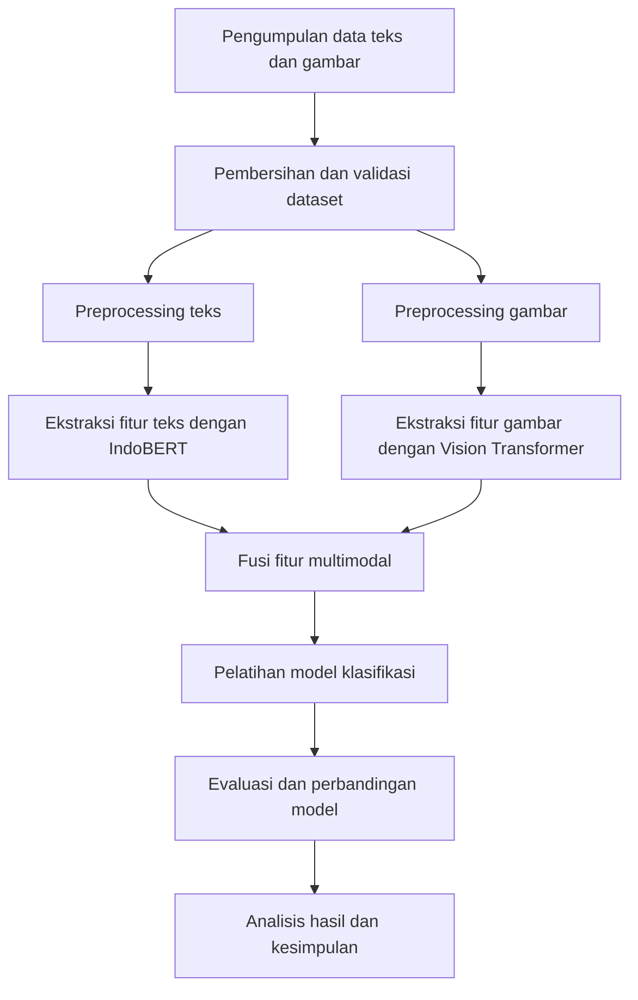

# PROPOSAL SKRIPSI

# DETEKSI BERITA PALSU MULTIMODAL BERBAHASA INDONESIA BERBASIS INDOBERT DAN VISION TRANSFORMER

**Oleh**  
Harvest Ecclessiano Christ Walukow  
NIM: 164231104  

Program Studi S1 Teknologi Sains Data  
Fakultas Teknologi Maju dan Multidisiplin  
Universitas Airlangga  
2026

---

# LEMBAR PENGESAHAN

Proposal skripsi dengan judul **"Deteksi Berita Palsu Multimodal Berbahasa Indonesia Berbasis IndoBERT dan Vision Transformer"** yang disusun oleh:

Nama: Harvest Ecclessiano Christ Walukow  
NIM: 164231104  
Program Studi: S1 Teknologi Sains Data  

telah disetujui untuk diajukan dalam seminar proposal skripsi Program Studi S1 Teknologi Sains Data, Fakultas Teknologi Maju dan Multidisiplin, Universitas Airlangga.

Surabaya, .................... 2026

Pembimbing I,  

(.............................................)

Pembimbing II,  

(.............................................)

Mengetahui,  
Koordinator Program Studi S1 Teknologi Sains Data

(.............................................)

---

# KATA PENGANTAR

Puji syukur penulis panjatkan ke hadirat Tuhan Yang Maha Esa karena atas rahmat dan karunia-Nya proposal skripsi yang berjudul **"Deteksi Berita Palsu Multimodal Berbahasa Indonesia Berbasis IndoBERT dan Vision Transformer"** dapat disusun. Proposal ini disusun sebagai rancangan penelitian tugas akhir pada Program Studi S1 Teknologi Sains Data, Fakultas Teknologi Maju dan Multidisiplin, Universitas Airlangga.

Penelitian ini dilatarbelakangi oleh meningkatnya penyebaran berita palsu di ruang digital Indonesia, terutama pada konten yang menggabungkan narasi teks dan gambar. Pendekatan deteksi yang hanya berbasis teks masih berpotensi melewatkan ketidaksesuaian antara isi berita dan gambar pendukung. Oleh karena itu, proposal ini mengembangkan rancangan model deteksi berita palsu berbasis pembelajaran multimodal dengan memanfaatkan IndoBERT untuk representasi teks dan Vision Transformer untuk representasi gambar.

Penulis menyadari bahwa proposal ini masih memerlukan penyempurnaan, terutama dalam penyesuaian teknis dataset dan rancangan eksperimen. Oleh karena itu, kritik dan saran dari dosen pembimbing serta pihak terkait sangat diharapkan agar penelitian ini dapat dilaksanakan secara lebih terarah.

Surabaya, Juni 2026  
Penulis

---

# DAFTAR ISI

LEMBAR PENGESAHAN  
KATA PENGANTAR  
DAFTAR ISI  
DAFTAR TABEL  
DAFTAR GAMBAR  
BAB I PENDAHULUAN  
1.1 Latar Belakang  
1.2 Rumusan Masalah  
1.3 Tujuan Penelitian  
1.4 Manfaat Penelitian  
1.5 Hipotesis Penelitian  
1.6 Batasan Masalah  
BAB II TINJAUAN PUSTAKA  
2.1 Berita Palsu dan Disinformasi Digital  
2.2 Natural Language Processing untuk Deteksi Berita Palsu  
2.3 IndoBERT  
2.4 Vision Transformer  
2.5 Pembelajaran Multimodal  
2.6 Penelitian Terdahulu  
BAB III METODE PENELITIAN  
3.1 Jenis dan Rancangan Penelitian  
3.2 Lokasi dan Waktu Penelitian  
3.3 Bahan dan Alat  
3.4 Dataset dan Teknik Pengumpulan Data  
3.5 Variabel Penelitian  
3.6 Cara Kerja Penelitian  
3.7 Rancangan Model  
3.8 Skenario Eksperimen  
3.9 Evaluasi Model  
3.10 Jadwal Penelitian  
DAFTAR PUSTAKA

---

# DAFTAR TABEL

Tabel 2.1 Penelitian Terdahulu  
Tabel 3.1 Variabel Penelitian  
Tabel 3.2 Skenario Eksperimen  
Tabel 3.3 Jadwal Penelitian

# DAFTAR GAMBAR

Gambar 3.1 Diagram Alir Penelitian

---

# BAB I

# PENDAHULUAN

## 1.1 Latar Belakang

Perkembangan teknologi informasi telah mempercepat proses produksi, distribusi, dan konsumsi informasi. Masyarakat dapat memperoleh berita melalui portal berita daring, media sosial, aplikasi pesan instan, dan berbagai kanal digital lain dalam waktu yang sangat singkat. Kemudahan ini memberi manfaat besar bagi akses informasi, tetapi juga membuka ruang bagi penyebaran informasi yang tidak benar, menyesatkan, atau sengaja dimanipulasi. Salah satu bentuknya adalah berita palsu atau *fake news*, yaitu informasi yang disusun seolah-olah benar, tetapi mengandung klaim yang salah, tidak akurat, atau dilepaskan dari konteks yang semestinya.

Di Indonesia, penyebaran berita palsu menjadi masalah yang penting karena dapat memengaruhi kepercayaan publik, stabilitas sosial, keputusan politik, perilaku kesehatan, dan aktivitas ekonomi. Kementerian Komunikasi dan Digital melaporkan identifikasi 1.923 konten hoaks sepanjang tahun 2024. Angka tersebut menunjukkan bahwa hoaks bukan hanya persoalan komunikasi, tetapi juga persoalan pengolahan informasi yang membutuhkan dukungan teknologi deteksi otomatis. Deteksi manual oleh pemeriksa fakta tetap penting, namun proses tersebut membutuhkan waktu, tenaga, dan verifikasi kontekstual yang tidak selalu sebanding dengan kecepatan penyebaran konten digital.

Pendekatan komputasional untuk deteksi berita palsu telah banyak dikembangkan menggunakan *machine learning* dan *natural language processing* (NLP). Model berbasis teks seperti Naive Bayes, Support Vector Machine, Long Short-Term Memory, BERT, dan variasi model Transformer mampu mempelajari pola linguistik, struktur kalimat, pilihan kata, serta hubungan semantik dalam berita. Untuk bahasa Indonesia, kehadiran model pra-latih seperti IndoBERT menjadi penting karena model tersebut dilatih pada korpus bahasa Indonesia sehingga lebih sesuai untuk memahami karakteristik morfologi, kosakata, dan konteks bahasa Indonesia dibandingkan model umum berbahasa Inggris.

Namun, konten berita di ruang digital saat ini jarang hadir hanya dalam bentuk teks. Banyak berita dan unggahan informasi disertai gambar, tangkapan layar, poster, atau foto yang digunakan untuk memperkuat kesan kebenaran. Dalam kasus berita palsu, gambar dapat berupa gambar lama yang digunakan ulang pada konteks berbeda, gambar yang tidak berhubungan dengan isi teks, gambar hasil manipulasi, atau gambar yang secara emosional memperkuat narasi palsu. Kondisi ini menyebabkan pendekatan deteksi berbasis teks saja berpotensi tidak cukup, karena model tidak mengevaluasi hubungan antara narasi teks dan bukti visual yang menyertainya.

Pembelajaran multimodal menjadi alternatif yang relevan karena memungkinkan model memanfaatkan lebih dari satu jenis data. Pada penelitian ini, modalitas teks diproses menggunakan IndoBERT, sedangkan modalitas gambar diproses menggunakan Vision Transformer (ViT). IndoBERT dipilih karena mampu menghasilkan representasi kontekstual untuk teks berbahasa Indonesia, sementara ViT dipilih karena arsitektur Transformer pada citra mampu memodelkan hubungan antar-*patch* gambar secara global. Dengan menggabungkan kedua representasi tersebut, model diharapkan dapat menangkap informasi tekstual, informasi visual, dan hubungan antara keduanya.

Penelitian terdahulu menunjukkan bahwa integrasi teks dan gambar dapat meningkatkan kemampuan deteksi berita palsu, terutama ketika terdapat ketidaksesuaian semantik antar-modalitas. Meskipun demikian, penelitian multimodal untuk berita palsu berbahasa Indonesia masih relatif terbatas dibandingkan penelitian pada dataset berbahasa Inggris atau Mandarin. Sebagian penelitian Indonesia masih berfokus pada teks, sedangkan pemanfaatan gambar sebagai modalitas tambahan belum banyak dieksplorasi secara sistematis. Oleh karena itu, penelitian ini diarahkan untuk mengembangkan dan mengevaluasi model deteksi berita palsu berbahasa Indonesia berbasis IndoBERT dan Vision Transformer.

Kontribusi utama penelitian ini adalah rancangan eksperimen yang membandingkan model berbasis teks, model berbasis gambar, dan model multimodal. Perbandingan tersebut penting agar peningkatan performa tidak hanya diasumsikan, tetapi diuji melalui metrik evaluasi yang terukur. Selain itu, penelitian ini juga akan menganalisis apakah penggabungan fitur teks dan gambar benar-benar memberikan manfaat pada konteks berita palsu berbahasa Indonesia. Dengan demikian, penelitian ini diharapkan dapat menjadi dasar pengembangan sistem deteksi hoaks yang lebih adaptif terhadap bentuk konten digital yang semakin multimodal.

## 1.2 Rumusan Masalah

Berdasarkan latar belakang tersebut, rumusan masalah dalam penelitian ini adalah sebagai berikut:

1. Bagaimana membangun model deteksi berita palsu berbahasa Indonesia dengan pendekatan multimodal yang memanfaatkan teks dan gambar?
2. Bagaimana performa model berbasis IndoBERT, model berbasis Vision Transformer, dan model multimodal dalam mengklasifikasikan berita benar dan berita palsu?
3. Apakah pendekatan multimodal berbasis penggabungan representasi teks dan gambar mampu meningkatkan performa dibandingkan pendekatan unimodal berbasis teks saja?

## 1.3 Tujuan Penelitian

Tujuan penelitian ini adalah sebagai berikut:

1. Mengembangkan model deteksi berita palsu berbahasa Indonesia menggunakan pendekatan multimodal berbasis IndoBERT dan Vision Transformer.
2. Mengukur performa model teks, model gambar, dan model multimodal menggunakan metrik akurasi, presisi, *recall*, F1-score, dan AUC.
3. Menganalisis efektivitas penggabungan fitur teks dan gambar dalam meningkatkan kinerja deteksi berita palsu berbahasa Indonesia.

## 1.4 Manfaat Penelitian

### 1.4.1 Manfaat Teoritis

Penelitian ini diharapkan memberikan kontribusi pada pengembangan ilmu di bidang *machine learning*, *natural language processing*, *computer vision*, dan pembelajaran multimodal. Secara khusus, penelitian ini dapat memperkaya kajian mengenai penerapan model Transformer untuk deteksi berita palsu berbahasa Indonesia yang tidak hanya memperhatikan teks, tetapi juga gambar sebagai bagian dari konteks informasi.

### 1.4.2 Manfaat Praktis

Secara praktis, penelitian ini diharapkan dapat menjadi dasar pengembangan sistem pendukung deteksi berita palsu bagi pemeriksa fakta, pengelola platform digital, media daring, maupun masyarakat. Model yang dikembangkan dapat membantu proses penyaringan awal terhadap konten yang berpotensi palsu sehingga proses verifikasi manual dapat dilakukan secara lebih terarah.

## 1.5 Hipotesis Penelitian

Hipotesis dalam penelitian ini adalah pendekatan multimodal yang menggabungkan representasi teks dari IndoBERT dan representasi gambar dari Vision Transformer menghasilkan performa deteksi berita palsu yang lebih baik dibandingkan model unimodal berbasis teks saja, terutama pada data berita yang memiliki ketidaksesuaian antara narasi teks dan gambar pendukung.

## 1.6 Batasan Masalah

Batasan masalah dalam penelitian ini adalah sebagai berikut:

1. Data yang digunakan berupa berita atau unggahan klarifikasi berbahasa Indonesia yang memiliki komponen teks dan gambar.
2. Klasifikasi dilakukan dalam dua kelas, yaitu berita benar dan berita palsu.
3. Modalitas yang digunakan hanya teks dan gambar; video, audio, metadata penyebaran, komentar pengguna, dan struktur jaringan sosial tidak digunakan.
4. Model teks menggunakan IndoBERT atau variasi model IndoBERT yang tersedia secara publik.
5. Model gambar menggunakan Vision Transformer pra-latih yang kemudian disesuaikan untuk tugas klasifikasi.
6. Evaluasi model dilakukan menggunakan metrik akurasi, presisi, *recall*, F1-score, AUC, dan *confusion matrix*.
7. Penelitian berfokus pada evaluasi performa model, bukan pada pembangunan aplikasi produksi.

---

# BAB II

# TINJAUAN PUSTAKA

## 2.1 Berita Palsu dan Disinformasi Digital

Berita palsu merupakan informasi yang dikemas menyerupai berita, tetapi mengandung klaim yang salah, menyesatkan, atau tidak sesuai fakta. Dalam konteks digital, berita palsu dapat menyebar melalui media sosial, portal berita tidak kredibel, aplikasi pesan, serta unggahan berbasis gambar. Berita palsu berbeda dari kesalahan informasi biasa karena sering kali disusun untuk memengaruhi opini, membangun sentimen, atau mendorong perilaku tertentu.

Deteksi berita palsu menjadi tantangan karena konten palsu dapat menggunakan gaya bahasa yang mirip dengan berita valid. Selain itu, penyebar berita palsu dapat memanfaatkan gambar untuk membangun kesan otentik. Gambar dapat memberikan efek emosional yang kuat dan membuat pembaca lebih mudah percaya. Oleh sebab itu, deteksi berita palsu perlu mempertimbangkan bukan hanya isi teks, tetapi juga hubungan antara teks dan gambar.

## 2.2 Natural Language Processing untuk Deteksi Berita Palsu

*Natural language processing* merupakan cabang kecerdasan buatan yang berfokus pada pemrosesan bahasa alami oleh komputer. Dalam deteksi berita palsu, NLP digunakan untuk mengekstraksi fitur dari teks, seperti kata kunci, struktur kalimat, sentimen, gaya penulisan, dan hubungan semantik. Pendekatan awal banyak menggunakan representasi seperti *bag-of-words*, TF-IDF, dan algoritma klasifikasi konvensional. Pendekatan tersebut relatif mudah diterapkan, tetapi sering kali belum mampu menangkap konteks kalimat secara mendalam.

Perkembangan model *deep learning* dan Transformer meningkatkan kemampuan pemodelan teks. BERT memperkenalkan representasi bahasa dua arah yang dapat memahami konteks kata berdasarkan kata sebelum dan sesudahnya. Pada tugas klasifikasi, representasi dari token khusus dapat digunakan sebagai vektor ringkasan untuk menentukan kelas. Model berbasis BERT kemudian diadaptasi ke berbagai bahasa, termasuk bahasa Indonesia melalui IndoBERT.

## 2.3 IndoBERT

IndoBERT merupakan model bahasa pra-latih berbasis Transformer untuk bahasa Indonesia. Model ini dikembangkan untuk mengatasi keterbatasan sumber daya NLP bahasa Indonesia dan meningkatkan performa pada berbagai tugas pemahaman bahasa. IndoBERT dilatih menggunakan korpus bahasa Indonesia sehingga mampu mempelajari karakteristik bahasa Indonesia, termasuk kosakata lokal, struktur kalimat, imbuhan, dan variasi ekspresi.

Dalam penelitian ini, IndoBERT digunakan sebagai ekstraktor fitur teks. Teks berita akan melalui proses pembersihan, normalisasi, tokenisasi, dan pemotongan panjang input sesuai batas model. Representasi keluaran IndoBERT kemudian digunakan sebagai fitur teks dalam klasifikasi berita palsu. Model IndoBERT juga dapat di-*fine-tune* agar bobotnya menyesuaikan dengan karakteristik dataset deteksi berita palsu.

## 2.4 Vision Transformer

Vision Transformer merupakan model pemrosesan citra yang mengadaptasi arsitektur Transformer untuk tugas visi komputer. Gambar dibagi menjadi sejumlah *patch*, kemudian setiap *patch* diubah menjadi representasi vektor. Representasi tersebut diproses oleh lapisan Transformer untuk mempelajari hubungan global antarbagian gambar. Pendekatan ini berbeda dari CNN tradisional yang memanfaatkan konvolusi lokal sebagai mekanisme utama ekstraksi fitur.

Dalam penelitian ini, Vision Transformer digunakan untuk mengekstraksi fitur visual dari gambar yang menyertai berita. Gambar akan disesuaikan ukurannya, dinormalisasi, dan dimasukkan ke model ViT pra-latih. Representasi visual yang dihasilkan kemudian digunakan dalam klasifikasi gambar secara unimodal maupun digabungkan dengan representasi teks dalam model multimodal.

## 2.5 Pembelajaran Multimodal

Pembelajaran multimodal adalah pendekatan yang menggabungkan dua atau lebih jenis data, seperti teks, gambar, audio, video, atau metadata. Pada deteksi berita palsu, pendekatan multimodal penting karena berita digital sering kali terdiri dari narasi dan elemen visual. Informasi pada satu modalitas dapat melengkapi atau mengoreksi informasi pada modalitas lain.

Penggabungan modalitas dapat dilakukan melalui beberapa strategi, seperti *early fusion*, *late fusion*, dan *intermediate fusion*. *Early fusion* menggabungkan fitur sebelum proses klasifikasi, *late fusion* menggabungkan hasil prediksi dari model berbeda, sedangkan *intermediate fusion* menggabungkan representasi pada lapisan tengah model. Penelitian ini menggunakan strategi penggabungan fitur pada tingkat representasi, yaitu menggabungkan vektor teks dari IndoBERT dan vektor gambar dari ViT, kemudian memasukkannya ke lapisan klasifikasi.

## 2.6 Penelitian Terdahulu

Tabel 2.1 merangkum beberapa penelitian terdahulu yang relevan dengan deteksi berita palsu, model bahasa Indonesia, Vision Transformer, dan pendekatan multimodal.

**Tabel 2.1 Penelitian Terdahulu**

| No | Peneliti | Fokus Penelitian | Metode | Relevansi dengan Penelitian Ini |
|---|---|---|---|---|
| 1 | Pratiwi, Asmara, dan Rahutomo (2017) | Deteksi hoaks berbahasa Indonesia | Naive Bayes | Menjadi rujukan awal bahwa deteksi hoaks bahasa Indonesia dapat dilakukan secara otomatis, tetapi masih berbasis teks dan metode konvensional. |
| 2 | Wilie dkk. (2020) | Benchmark pemahaman bahasa Indonesia | IndoBERT dan IndoNLU | Menjadi dasar pemilihan IndoBERT sebagai model representasi teks bahasa Indonesia. |
| 3 | Koto dkk. (2020) | Dataset dan model pra-latih bahasa Indonesia | IndoLEM dan IndoBERT | Menunjukkan pentingnya model bahasa yang sesuai dengan karakteristik bahasa Indonesia. |
| 4 | Dosovitskiy dkk. (2021) | Pengenalan citra berbasis Transformer | Vision Transformer | Menjadi dasar pemilihan ViT sebagai ekstraktor fitur visual. |
| 5 | Khattar dkk. (2019) | Deteksi berita palsu multimodal | Multimodal Variational Autoencoder | Menunjukkan bahwa representasi gabungan teks dan gambar dapat digunakan untuk mendeteksi berita palsu. |
| 6 | Yang dkk. (2023) | Deteksi berita palsu multimodal berbasis Transformer | Transformer dan fusi multimodal | Relevan karena menekankan pentingnya fitur visual berkualitas dan mekanisme fusi multimodal. |
| 7 | Shen dkk. (2024) | Deteksi berita palsu multimodal dengan penyelarasan fitur | Cross-modal attention, contrastive learning, optimal transport | Menunjukkan tantangan utama multimodal, yaitu penyelarasan teks dan gambar. |
| 8 | Kondamudi dkk. (2025) | Survei deteksi berita palsu multimodal | Tinjauan sistematis deep learning | Menjadi dasar pemahaman tren terbaru, tantangan fusi fitur, dan generalisasi model multimodal. |

Berdasarkan penelitian terdahulu, terdapat peluang penelitian pada konteks bahasa Indonesia. Penelitian Indonesia banyak berfokus pada teks, sedangkan penelitian multimodal umumnya menggunakan dataset non-Indonesia. Oleh karena itu, penelitian ini berupaya mengisi celah tersebut dengan merancang model multimodal untuk berita palsu berbahasa Indonesia dan mengevaluasinya terhadap model unimodal.

---

# BAB III

# METODE PENELITIAN

## 3.1 Jenis dan Rancangan Penelitian

Jenis penelitian ini adalah penelitian kuantitatif dengan pendekatan eksperimen. Penelitian dilakukan dengan membangun, melatih, dan mengevaluasi beberapa model klasifikasi berita palsu. Eksperimen dilakukan untuk membandingkan performa model unimodal berbasis teks, model unimodal berbasis gambar, dan model multimodal berbasis gabungan teks dan gambar.

Rancangan penelitian terdiri dari pengumpulan data, pelabelan atau penyesuaian label, preprocessing teks, preprocessing gambar, pembangunan model, pelatihan model, evaluasi, dan analisis hasil. Hasil akhir penelitian berupa model terbaik serta analisis pengaruh penggunaan modalitas gambar terhadap performa deteksi berita palsu.

## 3.2 Lokasi dan Waktu Penelitian

Penelitian direncanakan dilakukan secara komputasional di lingkungan Program Studi S1 Teknologi Sains Data, Fakultas Teknologi Maju dan Multidisiplin, Universitas Airlangga. Pengolahan data dan pelatihan model dilakukan menggunakan komputer pribadi atau layanan komputasi berbasis GPU seperti Google Colab, Kaggle Notebook, atau lingkungan komputasi lain yang tersedia. Waktu penelitian direncanakan berlangsung selama lima bulan, mulai dari penyusunan proposal hingga penyelesaian laporan skripsi.

## 3.3 Bahan dan Alat

Bahan yang digunakan dalam penelitian ini adalah dataset berita atau unggahan klarifikasi berbahasa Indonesia yang memiliki teks, gambar, dan label kebenaran. Sumber data yang direncanakan meliputi dataset hoaks bahasa Indonesia yang tersedia publik, arsip klarifikasi dari situs pemeriksa fakta seperti TurnBackHoax, serta berita valid dari portal berita kredibel sebagai pembanding. Pengambilan data dilakukan dengan memperhatikan ketersediaan akses, lisensi, dan etika penggunaan data.

Alat yang digunakan meliputi perangkat keras dan perangkat lunak. Perangkat keras minimal berupa komputer dengan RAM yang memadai dan, jika tersedia, GPU untuk mempercepat proses pelatihan. Perangkat lunak yang digunakan antara lain Python, PyTorch atau TensorFlow, Hugging Face Transformers, scikit-learn, pandas, NumPy, OpenCV atau Pillow, serta pustaka visualisasi seperti Matplotlib dan Seaborn.

## 3.4 Dataset dan Teknik Pengumpulan Data

Dataset penelitian akan disusun dalam bentuk pasangan teks dan gambar dengan label benar atau palsu. Data palsu dapat diperoleh dari arsip klarifikasi hoaks yang menyediakan narasi, gambar, dan status klaim. Data benar dapat diperoleh dari portal berita kredibel atau sumber resmi yang memuat berita dengan gambar pendukung. Setiap data akan disusun dengan atribut minimal berupa ID data, judul atau klaim, isi teks, path atau URL gambar, sumber, tanggal publikasi, dan label.

Jika satu konten memiliki lebih dari satu gambar, penelitian ini menggunakan gambar utama yang paling merepresentasikan isi berita. Jika gambar tidak dapat diakses atau kualitasnya terlalu rendah, data tersebut dapat dikeluarkan dari dataset agar setiap sampel tetap memiliki dua modalitas. Setelah data terkumpul, dilakukan pemeriksaan duplikasi, pengecekan label, dan pembagian data menjadi data latih, data validasi, dan data uji.

## 3.5 Variabel Penelitian

**Tabel 3.1 Variabel Penelitian**

| Jenis Variabel | Variabel | Keterangan |
|---|---|---|
| Variabel bebas | Teks berita | Judul, klaim, atau isi berita yang diproses menggunakan IndoBERT. |
| Variabel bebas | Gambar berita | Gambar utama yang menyertai berita atau unggahan klarifikasi dan diproses menggunakan ViT. |
| Variabel bebas | Arsitektur model | Model teks, model gambar, dan model multimodal. |
| Variabel terikat | Performa klasifikasi | Akurasi, presisi, recall, F1-score, AUC, dan confusion matrix. |
| Variabel kontrol | Pembagian dataset | Rasio data latih, validasi, dan uji dibuat sama pada seluruh eksperimen. |
| Variabel kontrol | Parameter pelatihan | Jumlah epoch, batch size, learning rate, optimizer, dan seed eksperimen dikendalikan. |
| Variabel kontrol | Proses preprocessing | Tahapan preprocessing teks dan gambar dibuat konsisten pada setiap skenario. |

## 3.6 Cara Kerja Penelitian

Tahapan penelitian ditunjukkan pada Gambar 3.1 dan dijelaskan sebagai berikut.

Tahap pertama adalah pengumpulan data berupa teks, gambar, dan label. Tahap kedua adalah pembersihan data, meliputi penghapusan data duplikat, pengecekan data kosong, validasi gambar, dan penyesuaian format label. Tahap ketiga adalah preprocessing teks, meliputi normalisasi karakter, penghapusan elemen yang tidak relevan, tokenisasi menggunakan tokenizer IndoBERT, serta pemotongan atau padding hingga panjang input tertentu. Tahap keempat adalah preprocessing gambar, meliputi pengunduhan gambar, konversi format warna, resizing ke ukuran input ViT, dan normalisasi piksel.

Tahap kelima adalah ekstraksi fitur teks menggunakan IndoBERT. Representasi teks diambil dari token khusus atau pooling keluaran model. Tahap keenam adalah ekstraksi fitur gambar menggunakan Vision Transformer. Representasi visual diambil dari token klasifikasi atau pooling fitur gambar. Tahap ketujuh adalah fusi fitur, yaitu penggabungan representasi teks dan gambar menggunakan konkatenasi yang diikuti lapisan *fully connected*. Tahap kedelapan adalah pelatihan model klasifikasi. Tahap terakhir adalah evaluasi dan analisis hasil untuk menentukan apakah model multimodal memberikan peningkatan performa dibandingkan model unimodal.

## 3.7 Rancangan Model

Rancangan model penelitian terdiri dari tiga jenis model. Model pertama adalah model berbasis teks yang menggunakan IndoBERT. Teks berita dimasukkan ke IndoBERT, kemudian representasi keluaran digunakan untuk klasifikasi dua kelas. Model ini menjadi baseline utama karena sebagian besar penelitian deteksi berita palsu berfokus pada teks.

Model kedua adalah model berbasis gambar yang menggunakan Vision Transformer. Gambar utama dari setiap berita diproses menjadi ukuran input standar, kemudian dimasukkan ke ViT untuk menghasilkan representasi visual. Representasi tersebut diteruskan ke lapisan klasifikasi. Model ini digunakan untuk mengetahui sejauh mana informasi visual saja dapat membantu deteksi.

Model ketiga adalah model multimodal. Pada model ini, representasi teks dari IndoBERT dan representasi gambar dari ViT digabungkan melalui konkatenasi. Vektor gabungan kemudian diproses oleh beberapa lapisan *fully connected* dengan aktivasi non-linear dan dropout untuk mengurangi risiko overfitting. Lapisan akhir menggunakan fungsi aktivasi sigmoid atau softmax untuk menghasilkan probabilitas kelas benar dan palsu.

## 3.8 Skenario Eksperimen

Eksperimen dilakukan dalam beberapa skenario agar kontribusi setiap modalitas dapat dianalisis secara jelas.

**Tabel 3.2 Skenario Eksperimen**

| Skenario | Input | Model | Tujuan |
|---|---|---|---|
| S1 | Teks | TF-IDF + SVM atau Logistic Regression | Baseline konvensional berbasis teks. |
| S2 | Teks | IndoBERT | Mengukur performa model Transformer bahasa Indonesia. |
| S3 | Gambar | Vision Transformer | Mengukur kontribusi modalitas visual. |
| S4 | Teks dan gambar | IndoBERT + ViT dengan fusi konkatenasi | Mengukur performa multimodal utama. |
| S5 | Teks dan gambar | IndoBERT + ViT dengan variasi dropout atau learning rate | Menguji stabilitas dan konfigurasi model multimodal. |

Setiap skenario akan menggunakan pembagian dataset yang sama agar hasil evaluasi dapat dibandingkan secara adil. Jika jumlah data terbatas, penelitian dapat menggunakan *stratified k-fold cross validation* atau pembagian data berulang dengan seed berbeda untuk memperoleh hasil yang lebih stabil.

## 3.9 Evaluasi Model

Evaluasi model dilakukan menggunakan metrik akurasi, presisi, *recall*, F1-score, AUC, dan *confusion matrix*. Akurasi digunakan untuk melihat proporsi prediksi benar secara keseluruhan. Presisi digunakan untuk melihat ketepatan prediksi pada kelas berita palsu. *Recall* digunakan untuk mengukur kemampuan model menemukan berita palsu yang sebenarnya. F1-score digunakan sebagai rata-rata harmonik presisi dan *recall*, terutama ketika distribusi kelas tidak seimbang. AUC digunakan untuk melihat kemampuan model membedakan kelas pada berbagai ambang keputusan.

Selain metrik kuantitatif, analisis kesalahan juga dilakukan dengan meninjau beberapa sampel yang salah diklasifikasikan. Analisis ini bertujuan untuk memahami kondisi ketika model gagal, misalnya teks tampak meyakinkan tetapi gambar tidak relevan, gambar valid tetapi teks menyesatkan, atau model terlalu bergantung pada salah satu modalitas. Hasil analisis kesalahan akan digunakan untuk menjelaskan kekuatan dan keterbatasan model.

## 3.10 Jadwal Penelitian

Jadwal penelitian direncanakan selama lima bulan sebagaimana ditunjukkan pada Tabel 3.3.

**Tabel 3.3 Jadwal Penelitian**

| Kegiatan | Bulan 1 | Bulan 2 | Bulan 3 | Bulan 4 | Bulan 5 |
|---|---|---|---|---|---|
| Penyusunan dan revisi proposal | X |  |  |  |  |
| Studi literatur lanjutan | X | X |  |  |  |
| Pengumpulan dan validasi dataset |  | X | X |  |  |
| Preprocessing teks dan gambar |  | X | X |  |  |
| Pembangunan model baseline |  |  | X |  |  |
| Pembangunan model multimodal |  |  | X | X |  |
| Evaluasi dan analisis hasil |  |  |  | X |  |
| Penyusunan laporan skripsi |  |  |  | X | X |
| Persiapan sidang dan revisi akhir |  |  |  |  | X |

---

# DAFTAR PUSTAKA

Devlin, J., Chang, M.-W., Lee, K., dan Toutanova, K. (2019). BERT: Pre-training of deep bidirectional transformers for language understanding. *Proceedings of NAACL-HLT 2019*, 4171-4186. https://doi.org/10.18653/v1/N19-1423

Dosovitskiy, A., Beyer, L., Kolesnikov, A., Weissenborn, D., Zhai, X., Unterthiner, T., Dehghani, M., Minderer, M., Heigold, G., Gelly, S., Uszkoreit, J., dan Houlsby, N. (2021). An image is worth 16x16 words: Transformers for image recognition at scale. *International Conference on Learning Representations*. https://arxiv.org/abs/2010.11929

Kementerian Komunikasi dan Digital. (2025). *Komdigi identifikasi 1.923 konten hoaks sepanjang tahun 2024*. https://www.komdigi.go.id/berita/siaran-pers/detail/komdigi-identifikasi-1923-konten-hoaks-sepanjang-tahun-2024

Khattar, D., Goud, J. S., Gupta, M., dan Varma, V. (2019). MVAE: Multimodal variational autoencoder for fake news detection. *The World Wide Web Conference*, 2915-2921. https://doi.org/10.1145/3308558.3313552

Kondamudi, M. R., Rao, K. N., dan Zafar, A. (2025). Multi-modal fake news detection: A comprehensive survey on deep learning technology, advances, and challenges. *Journal of King Saud University - Computer and Information Sciences*. https://doi.org/10.1007/s44443-025-00317-7

Koto, F., Rahimi, A., Lau, J. H., dan Baldwin, T. (2020). IndoLEM and IndoBERT: A benchmark dataset and pre-trained language model for Indonesian NLP. *Proceedings of the 28th International Conference on Computational Linguistics*, 757-770. https://doi.org/10.18653/v1/2020.coling-main.66

Pratiwi, I. Y. R., Asmara, R. A., dan Rahutomo, F. (2017). Study of hoax news detection using naive Bayes classifier in Indonesian language. *2017 11th International Conference on Information & Communication Technology and System (ICTS)*, 73-78. https://doi.org/10.1109/ICTS.2017.8265649

Shen, X., Huang, M., Hu, Z., Cai, S., dan Zhou, T. (2024). Multimodal fake news detection with contrastive learning and optimal transport. *Frontiers in Computer Science, 6*, 1473457. https://doi.org/10.3389/fcomp.2024.1473457

Shu, K., Sliva, A., Wang, S., Tang, J., dan Liu, H. (2017). Fake news detection on social media: A data mining perspective. *ACM SIGKDD Explorations Newsletter, 19*(1), 22-36. https://doi.org/10.1145/3137597.3137600

Singhal, S., Shah, R. R., Chakraborty, T., Kumaraguru, P., dan Satoh, S. (2019). SpotFake: A multi-modal framework for fake news detection. *2019 IEEE Fifth International Conference on Multimedia Big Data*, 39-47. https://doi.org/10.1109/BigMM.2019.00-44

Wilie, B., Vincentio, K., Winata, G. I., Cahyawijaya, S., Li, X., Lim, Z. Y., Soleman, S., Mahendra, R., Fung, P., Bahar, S., dan Purwarianti, A. (2020). IndoNLU: Benchmark and resources for evaluating Indonesian natural language understanding. *Proceedings of the 1st Conference of the Asia-Pacific Chapter of the Association for Computational Linguistics and the 10th International Joint Conference on Natural Language Processing*, 843-857. https://arxiv.org/abs/2009.05387

Yang, P., Ma, J., Liu, Y., dan Liu, M. (2023). Multi-modal transformer for fake news detection. *Mathematical Biosciences and Engineering, 20*(8), 14699-14717. https://doi.org/10.3934/mbe.2023657
